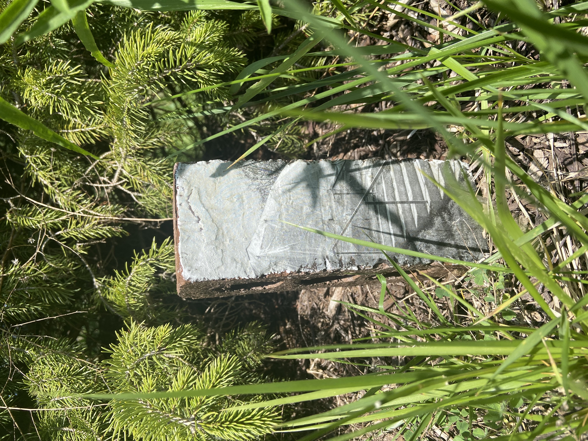
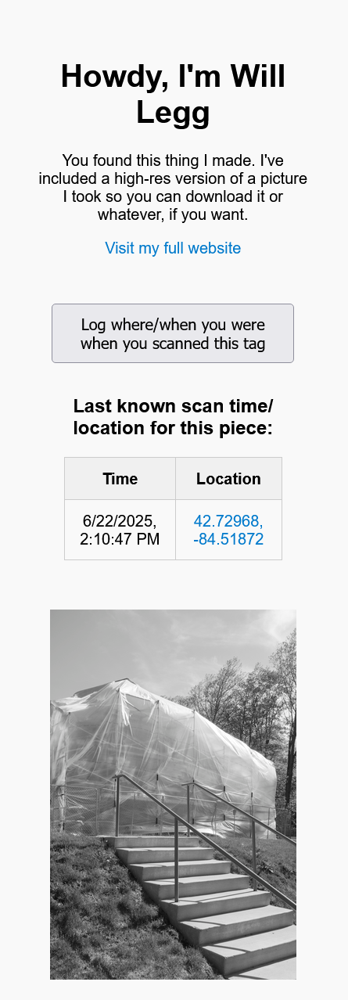
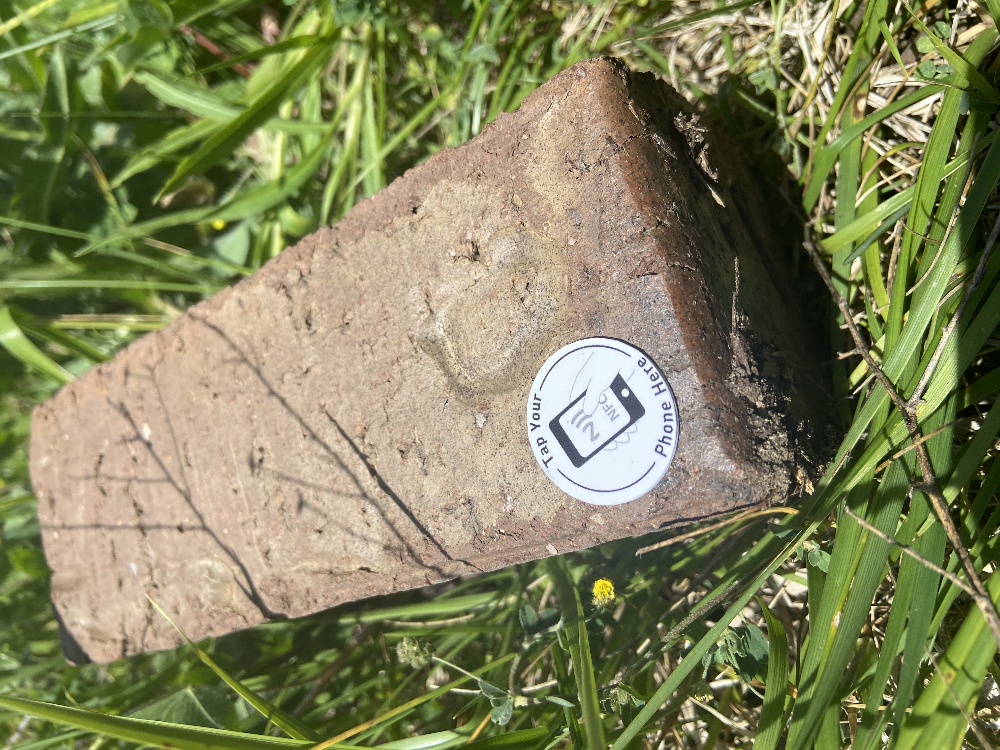

# pictures

# NFC-Linked Photography Pages

This project hosts individual high-resolution images associated with physical artworks or objects that contain embedded NFC tags and barcodes. When a person scans the tag, they are directed to a dedicated webpage for that image.

Each page contains:
- A high-resolution version of the image
- A short description and link to the creator’s full website
- A button allowing users to optionally log their location at the time of the scan
- A table displaying recent locations where the tag was scanned

Location data is collected and stored via Firebase Realtime Database and displayed on the page with timestamp and coordinates (linked to Google Maps). Users must grant permission for their location to be logged.

## How It Works

1. An NFC tag is programmed with a URL to the corresponding HTML file in this repository (hosted via GitHub Pages).
2. When the page loads, visitors can optionally share their location.
3. If permission is granted, coordinates and a timestamp are stored in Firebase.
4. Logged scan locations are retrieved from Firebase and shown in a table.

## NFC Tag Details

- Tags used: **NTAG215 NFC stickers**
- The tags are programmed with a URL to the corresponding image page 
- Most smartphones can scan the tag directly without a separate app
- When scanned, the browser opens the hosted webpage for the corresponding object
- Tags are embedded on physical objects

## Dependencies

- GitHub Pages (for static site hosting)
- Firebase Realtime Database (for storing and retrieving location logs)

## Author

Will Legg  
[https://www.wlegg.com](https://www.wlegg.com)